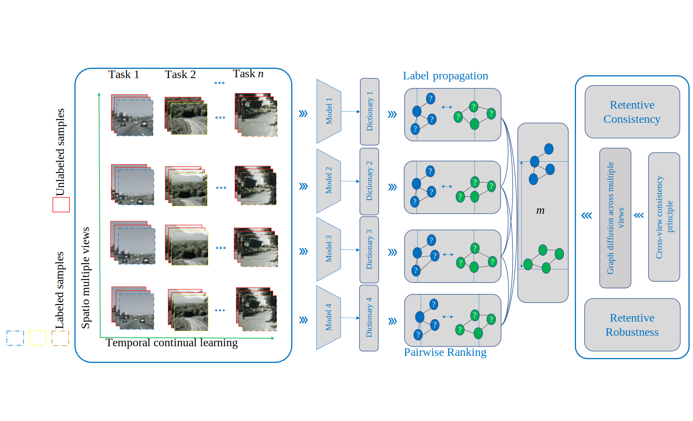

# Spatiotemporal Multi-view Continual Dictionary Learning with Graph Diffusion

---

[//]: # (<font size="10"><b><center>Contrastive Multi-view Continual Learning</center></b></font>)

This repository is the PyTorch source code implementation of 
[Spatiotemporal Multi-view Continual Dictionary Learning with Graph Diffusion](). This is a demo code to illustrate the basic motivation 
for fast training and evaluating the STKR model.

<div align="center">

</div>
Spatiotemporal unlabeled streaming data acquisitions from different views. This work proposed to leverage label propagation, pairwise ranking and cross-view graph diffusion with view-specific learnable dictionaries to process multi-view data streaming with limited annotation. We leverage the spatial consistent principle of multi-view learning to equalize retentive  intensities among sub-models, enhancing retentive robustness beyond single-view continual learning approaches.

## Usage

---

### Requirements

We use single RTX A6000 48G GPU for training and evaluation. Refer to `hardware.txt` for hardware related parameters.
To install a working environment run:

```
pip install -r requirements.txt
```

Please log in to your own wandb key in advance to record experimental results.

```
wandb.login(key="your wandb key")
```

### Prepare Datasets

You can download the data in
[Google Drive](https://drive.google.com/file/d/1Is9GeVAe9vy1l5xg7Xqwa9lXAYRm3PMu/view?usp=sharing)
and put the downloading file to the root path of the project to evaluate our method.
Organize the file in root dir folder as follows:

```
├── argpaser.py                           # Hyperparameters
├── featureloader.py                      # Dataloader
├── hardware.txt                          
├── learner.py                            # Train and Test
├── loss.py                               # Loss function
├── main.py                               
├── projector.py                          # Neural network architectures
├── requirements.txt                      
├── view_reliability.py                   
└── xy_tensor_uiuc.pt                     # Data
```

### Demo validation

```
python main.py
```

### Ablation

| $\mathcal{L}_\text{VSKR}$ | $\mathcal{L}_\text{CPRR}$ | $\mathcal{L}_\text{CACO}$ | $\mathcal{L}_\text{CVDC}$ | $\mathcal{L}_\text{RECT}$ | UIUC-Sports |
|:-------------------------:|:-------------------------:|:-------------------------:|:-------------------------:|:-------------------------:|:-----------:|
| ✓                         |                           | ✓                         |                           |                           | 85.26       |
| ✓                         | ✓                         | ✓                         |                           |                           | 85.35       |
| ✓                         |                           |                           | ✓                         |                           | 88.15       |
| ✓                         | ✓                         |                           | ✓                         |                           | 88.70       |
| ✓                         |                           |                           |                           | ✓                         | 88.87       |
| ✓                         | ✓                         |                           |                           | ✓                         | 89.01       |
| ✓                         | ✓                         | ✓                         | ✓                         |                           | 85.26       |
| ✓                         | ✓                         | ✓                         |                           | ✓                         | 85.34       |

